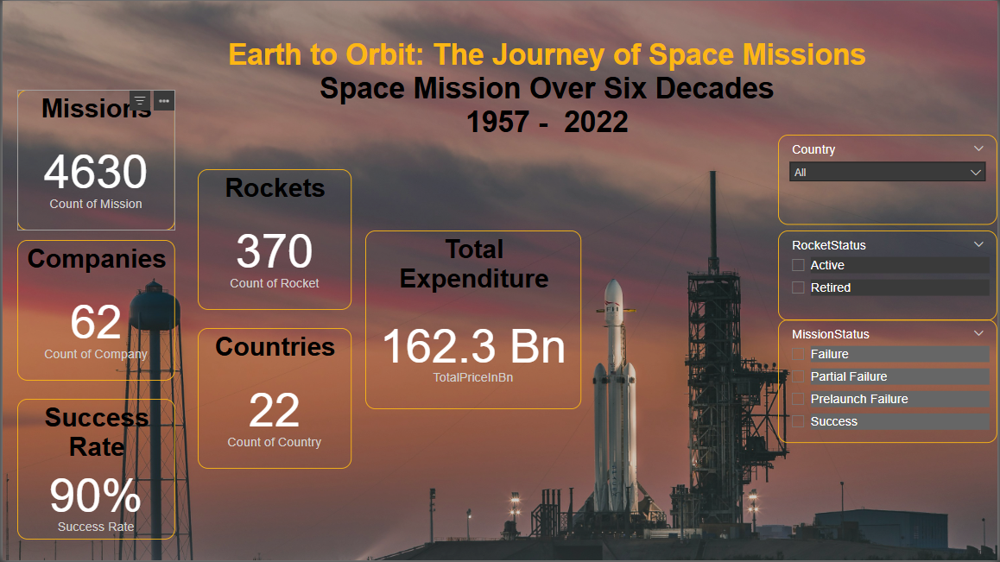
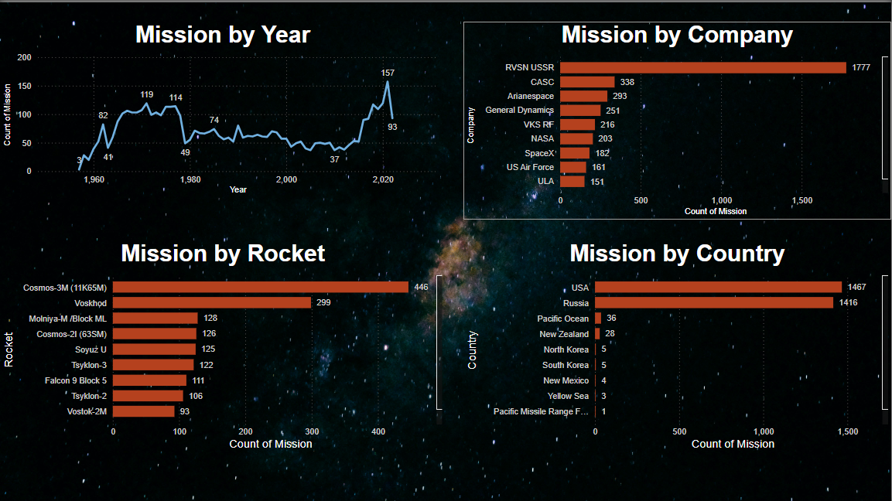
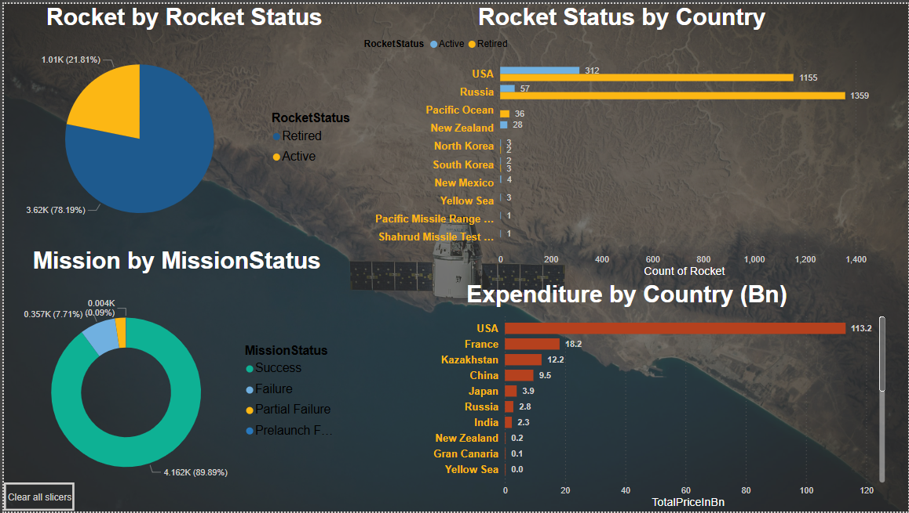

**Earth to Orbit: The Journey of Space Missions (1957-2022)**

---

## 🌌 **Project Overview**

This project explores the journey of space missions over six decades (1957–2022), visualized using **Power BI**. The dataset captures key insights into the number of missions, companies involved, countries participating, rocket statuses, and expenditures. This analysis provides a comprehensive view of global space exploration.

---
## Visuals

## 📊 **Key Insights**

### 🚀 **General Overview**
- **Total Missions**: **4,630**
- **Number of Companies**: **62**
- **Success Rate**: **90%**
- **Number of Rockets**: **370**
- **Countries Involved**: **22**
- **Total Expenditure**: **$162.3 Billion**

---

### 📈 **Detailed Insights**

#### 1. **Mission Success Rates**
- **Success**: 89.89% (4,162 missions)
- **Failure**: 7.71% (357 missions)
- **Partial Failure**: 2.3% (106 missions)
- **Prelaunch Failure**: 0.09% (4 missions)

#### 2. **Top Companies by Mission Count**
- **RVSN USSR**: 1,777 missions
- **CASC (China Aerospace)**: 338 missions
- **Arianespace**: 293 missions
- **SpaceX**: 182 missions
- **NASA**: 203 missions

#### 3. **Top Rockets by Mission Count**
- **Cosmos-3M (11K65M)**: 446 missions
- **Voskhod**: 299 missions
- **Falcon 9 Block 5**: 111 missions
- **Soyuz U**: 125 missions

#### 4. **Expenditure by Country**
- **USA**: $113.2 Billion
- **France**: $18.2 Billion
- **Kazakhstan**: $12.2 Billion
- **China**: $9.5 Billion
- **Japan**: $3.9 Billion

#### 5. **Rockets by Status**
- **Active Rockets**: 1,010 (21.81%)
- **Retired Rockets**: 3,620 (78.19%)

#### 6. **Mission Trends by Year**
- The number of missions peaked in the late 1980s and early 2000s, reflecting the space race and advancements in reusable rockets.
- **Notable Years**:
  - 1967: 157 missions
  - 1980: 119 missions
  - 2020: 114 missions

---

## 📂 **Visuals in the Dashboard**

### 1. **Global Overview**
   - Displays the total number of missions, companies, rockets, countries, and success rates.

### 2. **Mission Analysis**
   - **Bar Chart**: Missions by year.
   - **Pie Chart**: Mission success rates.

### 3. **Expenditure Analysis**
   - **Bar Chart**: Expenditure by country in billions.
   - Highlights the USA as the largest contributor with over $113 billion in spending.

### 4. **Rocket Analysis**
   - **Bar Chart**: Active vs. retired rockets by country.
   - **Pie Chart**: Rocket status globally.

### 5. **Company Insights**
   - **Bar Chart**: Top 10 companies by mission count.

---

## 📈 **How to Use the Dashboard**

1. **Interactive Filters**:
   - Filter by **Mission Status**, **Country**, or **Rocket Status** using slicers.
   - Drill through visuals to analyze trends for specific companies or countries.

2. **Explore Key Metrics**:
   - Use tooltips to view detailed data for each mission.
   - Highlight specific years or regions for trends.

---

## 🌟 **Future Improvements**
1. Add drill-through pages for company-specific insights.
2. Enhance the dataset with more recent missions beyond 2022.
3. Incorporate satellite data for further exploration of payload types.

---

---

## 📌 **Key Takeaways**
- The majority of missions are successful, with a few failures indicating the challenges of space exploration.
- The USA and Russia are the dominant players, accounting for most missions and expenditure.
- Reusable rockets, such as SpaceX's Falcon 9, are reshaping the industry and reducing costs.

---

Feel free to contact for any further enhancements or analyses! 🚀
